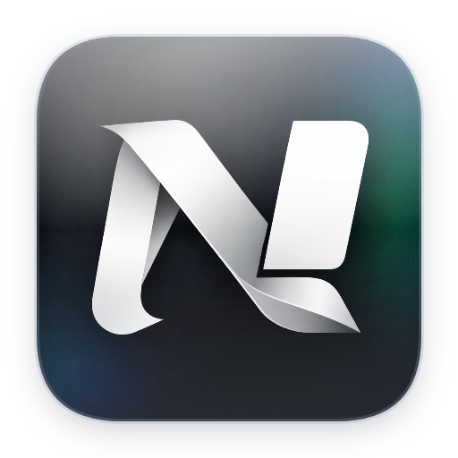

## Labonair Terminal and SSH, SFTP


### `Labonair`
<p><strong>macOS-native remote workspace — SSH · SFTP · Terminal · Editor · AI</strong></p>

Labonair is a macOS-native remote workspace built on Tauri 2 + Rust and React 19. It combines SSH terminal sessions, a full-featured SFTP file manager, an integrated code editor with remote editing support, Git source control + commit graph, and a first-class AI side-panel — all in a single lightweight app. Secrets are stored locally with optional AES-256-GCM encryption, no telemetry, no account required.

  <p>
    
    
    
    
  </p>

---


## Features

**SSH Terminal**
- Native async SSH backend via `russh` + `russh-sftp`, local shells via `portable-pty` — one tab per connection
- xterm.js + WebGL renderer, multi-tab with background streaming
- **Recursive split-pane workspace** — infinite horizontal (`⌘D`) and vertical (`⌘⇧D`) splits per tab; resize handles, click-to-focus, close pane with `⌘⇧W`
- Terminal history survives split/close (no remounts — flat render layer architecture)
- Shell integration (cwd reporting, prompt markers) via injected init scripts
- Inline search, link detection, true-color, 2FA / keyboard-interactive auth
- Known-host fingerprint verification with in-app warning flow

**SFTP File Manager**
- Virtualized split-pane browser (local ↔ remote) powered by `@tanstack/react-virtual`
- Background transfer queue with progress tracking and conflict resolution
- Context menus: rename, delete, mkdir, chmod, download, upload
- Drag-and-drop transfers between panes

**Remote Editor**
- Open remote files directly in the editor via SFTP (`prepare_remote_edit` / `save_remote_edit`)
- CodeMirror 6 with language support for TS/JS, Rust, Python, Go, Java, C/C++, SQL, PHP, HTML/CSS/XML, JSON, YAML/TOML, Markdown, Shell, Dockerfile, Ruby, Swift, Kotlin
- Inline AI autocomplete and AI edit diffs
- Vim mode + prebuilt themes (Tokyo Night, Nord, GitHub, Atom One, Aura, Copilot, Xcode)

**Source Control & Git Graph**
- VS Code-style staging UI — stage/unstage whole files or individual hunks, side-by-side diff viewer
- Branch bar with switch/create, stash management, commit form with AI-generated commit messages
- Interactive commit graph canvas with lane coloring; per-commit and per-file diff panels
- Submodule support; works local or remote (over an SSH session), shelling out to the system `git` CLI

**Host Manager**
- Master-detail host list with group organisation and drag-and-drop reorder
- Hosts stored in SQLite (`rusqlite`); passwords and credentials kept in local secret storage — never in SQLite
- Monochrome avatar icons (OS logos, shapes, symbols, numbers) per host
- Inspector pane: connection details, SFTP/tunnel config, notes
- Multi-select, context menus, inline group creation

**Local Terminal**
- Native PTY sessions for local shells (zsh, bash, …)
- Supports the same recursive split-pane layout as SSH terminals
- Auto-detects local dev servers and opens them in a web preview tab

**AI (BYOK)**
- Providers: OpenAI, Anthropic, Google, xAI, Cerebras, Groq, DeepSeek, Mistral, OpenRouter, OpenAI-compatible
- Local / offline models via LM Studio, MLX, and Ollama
- Multiple named chat sessions, voice input, edit diffs, multi-agent and sub-agents
- Live context from the active terminal/editor (cwd, buffer, selections)
- `LABONAIR.md` for project-level AI memory and configuration
- Tasks, search, file read/write/edit tools with in-app approval flow for mutating actions

**AI Agent Bridge (MCP)**
- Local MCP (Model Context Protocol) server lets an external agent you already run locally (e.g. the `claude` CLI, using your own subscription) drive a granted SSH tab — visibly, in the real terminal pane
- Per-tab opt-in consent (off by default) via the tab context menu; a header badge lists/revokes currently granted tabs at a glance
- Tools: list granted sessions, run a command and get back its output/exit code, peek at live output, send raw keystrokes, open/close SSH tabs to saved hosts
- One-time setup command generated in Settings → Connections; disabling the bridge instantly revokes every grant

**Snippets**
- Reusable command snippets with typed variables, runnable locally or over an SSH session
- Per-host picker, run log/output drawer, drag-and-drop reorder

**Quality**
- Lightweight, fast startup
- Secrets (host passwords, credentials, AI provider keys) stored locally in the app data dir, never in SQLite; optional AES-256-GCM at-rest encryption (Settings → General)
- No telemetry, no account required

## Host Setup

1. Open the **Host Manager** (sidebar icon, or via the Command Palette `⌘K`).
2. Click **+** to add a host — fill in hostname, port, username, and authentication method (password or private key).
3. Hosts are organised into groups; drag rows to reorder.
4. Connect via the **Connect** button or double-click — opens an SSH terminal tab.
5. Switch to the **SFTP** tab in the header to browse and transfer files.

## Configure AI

1. Open **Settings → AI**.
2. Pick a provider and paste your API key. For local inference, point Labonair at your LM Studio endpoint.
3. Keys are written to local secret storage (app data dir, optionally AES-256-GCM encrypted) — they never touch `localStorage` or the SQLite database.

## Installation

### Homebrew (recommended)

```sh
brew tap snenjih/labonair
brew install --cask labonair
```

Homebrew automatically removes the quarantine attribute, so the app opens without warnings.

### Manual

Download the latest `.dmg` from [Releases](https://github.com/Snenjih/labonair/releases), open it, and drag `Labonair.app` to `/Applications`.

If macOS blocks the app on first launch, run:

```sh
xattr -rd com.apple.quarantine /Applications/Labonair.app
```

Then right-click `Labonair.app` → **Open** → **Open** in the dialog.

---

## Build from source

**Prerequisites**
- Rust (stable) — https://rustup.rs
- Node 20+ and [pnpm](https://pnpm.io)
- macOS with Xcode Command Line Tools
- Tauri prerequisites — https://tauri.app/start/prerequisites/

**Run**
```bash
pnpm install
pnpm tauri dev        # development
pnpm tauri build      # production bundle (.app / .dmg)
```

**Checks**
```bash
pnpm exec tsc --noEmit          # frontend type-check
cd src-tauri && cargo check     # Rust check
cd src-tauri && cargo clippy    # Rust lint
```

## Tech stack

| Layer | Libraries |
|---|---|
| Desktop shell | Tauri 2 |
| Backend | Rust · Tokio · `russh` / `russh-sftp` · `portable-pty` · `rusqlite` |
| Frontend | React 19 · TypeScript · Vite |
| Terminal | xterm.js + WebGL addon |
| Editor | CodeMirror 6 |
| AI | Vercel AI SDK v6 |
| UI | Tailwind v4 · shadcn/ui · Zustand · `@tanstack/react-virtual` |

## Architecture

```
Labonair (Tauri v2)
├── Frontend: React 19 + TypeScript + Vite
│   ├── Tailwind CSS v4 + shadcn/ui
│   ├── Zustand (tabs, transfers, hosts, source control, snippets, providers, ...)
│   ├── xterm.js + WebGL (terminal rendering)
│   └── @tanstack/react-virtual (SFTP file lists)
└── Backend: Rust (Tokio async)
    ├── portable-pty → local terminal sessions
    ├── russh + russh-sftp → SSH terminal + SFTP protocol (native async)
    ├── rusqlite (bundled) → host/group/credential/snippet storage (SQLite)
    ├── git CLI (local, or remote over SSH) → source control
    ├── local secret storage (plain JSON, optional AES-256-GCM) → passwords + AI provider keys
    └── tokio mpsc → background transfer queue worker
```

All OS access lives in the Rust backend. The frontend communicates exclusively via Tauri `invoke()` calls and events — no direct filesystem, process, or network access from the webview.

## Contributing

Issues and PRs are welcome. See [CONTRIBUTING.md](CONTRIBUTING.md) for guidelines.

## License

Labonair is licensed under the Apache-2.0 License. See [LICENSE](LICENSE) for details.
